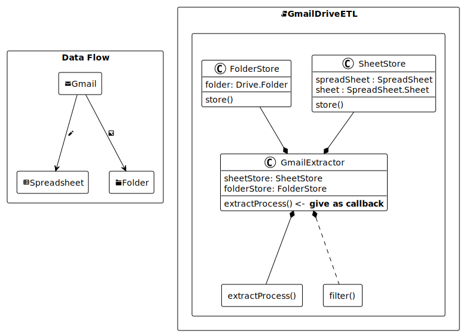

## GmailDriveETL GAS Library

Query and Filter Gmail messages as you like, store them to Spreadsheet and Drive.

Useful for managing your unique status of issues in your Gmail inbox.



### Features

 1. Gmail search **query**
    * see [Refine searches in Gmail \- Computer \- Gmail Help](https://support.google.com/mail/answer/7190)
 2. add **filter function** for more detailed message selection
    * see [Class GmailMessage  \|  Apps Script  \|  Google for Developers](https://developers.google.com/apps-script/reference/gmail/gmail-message)
 3. store messages to **Spreadsheet**
 4. store attachment files to Drive **Folder** with link in above sheet
 5. build your original extractProcess ( see below links )
    * [Class GmailMessage  \|  Apps Script  \|  Google for Developers](https://developers.google.com/apps-script/reference/gmail/gmail-message)
    * [Class GmailAttachment  \|  Apps Script  \|  Google for Developers](https://developers.google.com/apps-script/reference/gmail/gmail-attachment)
    * [Class Folder  \|  Apps Script  \|  Google for Developers](https://developers.google.com/apps-script/reference/drive/folder)
 6. can control around extraction process

### How to Use

 1. prepare Spreadsheet & Google Drive Folder
 2. open Google Apps Script Editor
 3. open Preference Settings
 4. copy & paste this line as Library GmailDriveETL's Script ID

```
1h-k6NPeJCQJW4T6Hv6XNc7V1AemOKjWCsJh79fqsdSvD2dAMEOXAj2oN
```
or copy & paste all codes

 5. prepare bootstrap, filter and storing codes like below

```javascript
function main () {
  const extractor = GmailDriveETL.createGmailExtractor({
    sheetStore: GmailDriveETL.createSheetStore(SpreadsheetApp.openById('xxxxx')),
    folderStore: GmailDriveETL.createFolderStore(DriveApp.getFolderById('xxxx')),
    query: query(), // default { after: <today>, has: 'attachment' }
    filter,
    extractProcess
  })
  const results = extractor.execute()

  if (results) {
    // <- write after-extract-process here.
  }
}

/**
 * see https://support.google.com/mail/answer/7190
 *
 * @returns {object}
 */
function query () {
  const d = new Date()
  const yesterday = new Date(d.getFullYear(), d.getMonth(), d.getDate() - 1)
  const yesterdayString = date.toISOString().split('T')[0]

  return {
    after: yesterdayString,
    from: 'mail@example.com',
    q: '研修 日時',
    subject: '-Re:'
  }
}

/**
 * @param {GoogleAppsScript.Gmail.GmailMessage} message
 * @returns {boolean}
 */
function filter (message) {
  ..
}

/**
 * extractProcess bound with GmailExtractor
 *
 * see
 *
 * https://developers.google.com/apps-script/reference/gmail/gmail-message
 * https://developers.google.com/apps-script/reference/gmail/gmail-attachment
 * https://developers.google.com/apps-script/reference/drive/folder
 *
 * @param {GoogleAppsScript.Gmail.GmailMessage} message
 * @param {GmailDriveETL.SheetStore} sheetStore
 * @param {GmailDriveETL.FolderStore} folderStore
 * @param {GoogleAppsScript.Drive.File[]} attachedFiles
 * @returns {Object} - anything
 */
function extractProcess (message, sheetStore, folderStore, attachedFiles) {
  const m = message

  const cols = [
    m.getFrom(),
    m.getDate(),
    m.getSubject(),
    extractBody(m.getPlainBody())
  ]
  sheetStore.store({ message, cols, files: attachedFiles })
  console.log('Gmail message id ${m.getId()} stored.`)

  return cols.slice[0, 3]
}

/**
 * @param {string} body
 * @returns {string}
 */
function extractBody (body) {
  return GmailDriveETL.stripSignature(body)
}
```
